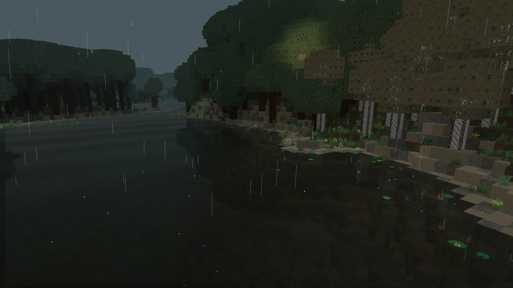
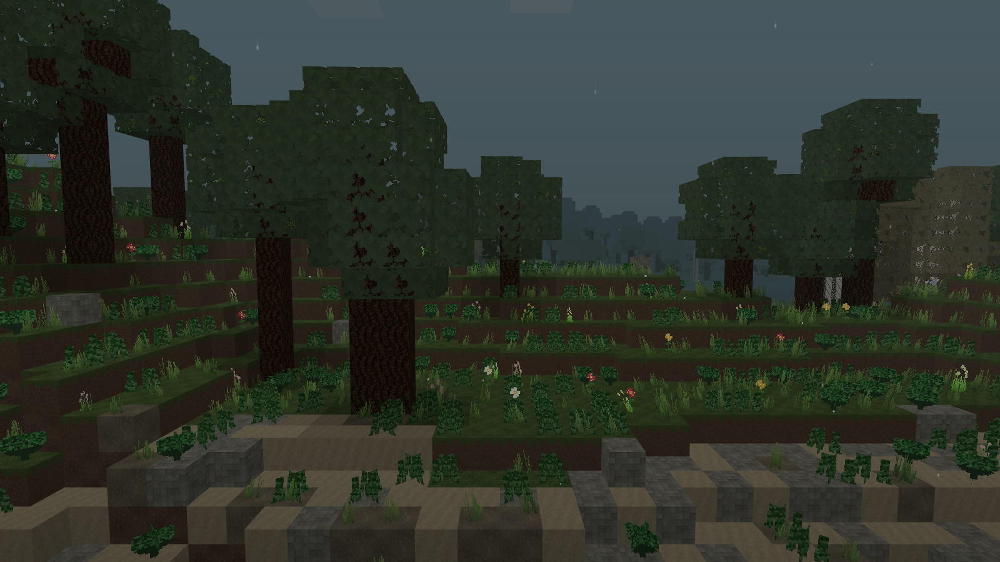
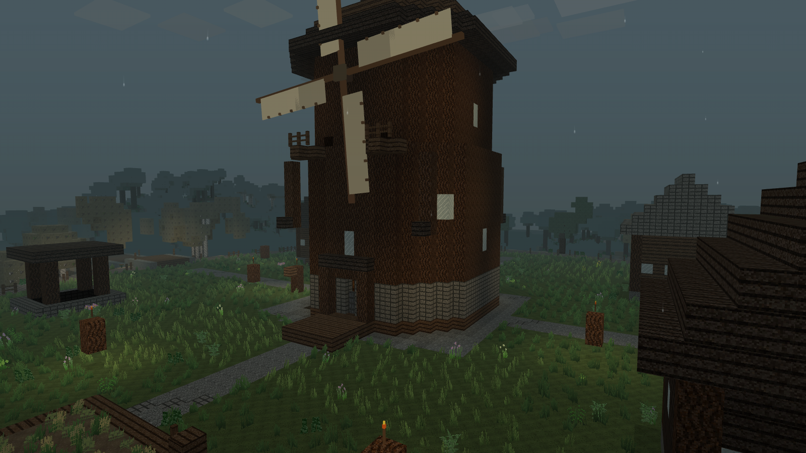
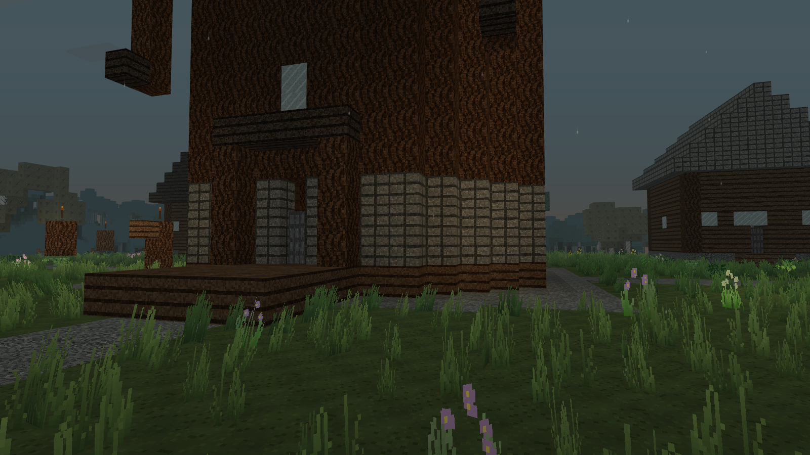

<div align="center">

# NIGHTCRAFT · COLD FOREST

**Survival horror w proceduralnym świecie voxelowym**

`V35.1` · `Windows / przeglądarka` · `WebGL + GLSL` · `Offline + multiplayer`

Zbuduj schronienie. Przywróć osadzie życie. Przetrwaj noc.

[Galeria](#galeria) · [Rozgrywka](#rozgrywka) · [Technologia](#technologia) · [Uruchomienie](#uruchomienie) · [Multiplayer](#multiplayer)

</div>



> Las, który za dnia daje surowce, po zmroku staje się zagrożeniem. NightCraft łączy budowanie i eksplorację z ograniczonymi zasobami, zachowaniem drapieżników i atmosferą niepokoju.

## Rozgrywka

| System | Co dzieje się w grze |
| :--- | :--- |
| **Survival** | Zdrowie, głód, stamina i stan psychiczny wpływają na wyprawy, walkę i odpoczynek. |
| **Eksploracja** | Świat powstaje z seeda; biomy, lasy, jaskinie, kopalnie, ruiny i skrzynie zachęcają do dalszych wypraw. |
| **Budowanie i rzemiosło** | Wydobywanie bloków, receptury, narzędzia, zużycie wyposażenia, przetapianie i stawianie własnych konstrukcji. |
| **Osada i młyn** | Kierunkowskaz prowadzi do osady. Misje, mieszkańcy, warsztat i prefabrykaty pozwalają rozbudowywać domy oraz obronę. |
| **Obrona** | Mury mają poziomy wytrzymałości, drzwi chronią wejścia, a strażnicy reagują na drapieżniki. |
| **Rolnictwo** | Uprawy rosną, można je zbierać i ponownie sadzić. Deszcz wpływa na wzrost. |
| **Horror i AI** | Wilki korzystają ze wzroku, słuchu, szukania ścieżki i taktyki stada. Nocne zdarzenia, odgłosy i zjawy budują napięcie. |
| **Żywy krajobraz** | Wiatr porusza roślinnością, drzewa przewracają się przy ścinaniu, ptaki i mieszkańcy ożywiają otoczenie. |
| **Nawigacja i rozwój** | Kompas, minimapa, mapa szlaku, księga misji i doświadczenie pomagają planować kolejne wyprawy. |

## Galeria

Rzeczywiste zrzuty aktualnej gry, wykonane w osobnej sesji. Interfejs ukryto na czas zdjęć.

### Woda podczas ulewy


Odbicia otoczenia, dno widoczne przy brzegu, ciemniejsza głębia, fale i kręgi po kroplach deszczu.

### Las i roślinność



Stonowana paleta, nieregularne prześwity koron, różne gatunki drzew i roślinność dopasowana do terenu.

### Osada wokół młyna



Młyn jest punktem orientacyjnym i centrum rozbudowy osady. Zabudowa, uprawy oraz oświetlenie tworzą miejsce powrotu z wypraw.

### Przy wejściu do młyna



Kamienna podstawa, drewniana konstrukcja, pochodnie i roślinność oglądane z perspektywy gracza.

## Technologia

Gra korzysta z własnego renderera i modułów JavaScript. Klient uruchamia natywne ES Modules bez bundlera w runtime; wersja Windows używa Electrona z Chromium.

| Mechanizm | Zastosowanie |
| :--- | :--- |
| **WebGL i shadery GLSL** | Renderowanie świata, materiałów, wody, mgły, nieba i animacji roślinności na GPU. |
| **Atlas tekstur** | Wspólne zasoby materiałów; ostre próbkowanie z bliska i mipmapy oraz anizotropia dla oddalonych powierzchni. Shader dobiera próbkowanie na podstawie pochodnych UV. |
| **Maski liści** | Binarne prześwity zamiast sortowania półprzezroczystych koron. Tylne powierzchnie liści są częścią siatki chunka. |
| **Odbicia wody** | Dodatkowy przebieg z odbitą kamerą, ograniczonym zasięgiem i rozdzielczością. Aktualizacja w każdej klatce ruchu; ponowne używanie obrazu przy nieruchomej kamerze. |
| **Światło i cienie** | Okluzja voxelowa uwzględniająca dachy i korony, światło słoneczne oraz lokalne źródła, m.in. pochodnie i ogniska. |
| **Streaming chunków** | Generowanie i przebudowa świata wokół gracza, kolejki pracy i odrzucanie geometrii poza polem widzenia przez frustum culling. |
| **Web Worker** | Generowanie terenu poza głównym wątkiem; transfer buforów i odrzucanie nieaktualnych wyników po zmianie świata. |
| **Deterministyczny świat** | Seed, szum i reguły biomów odtwarzają teren; zmiany gracza są nakładane na wygenerowane bloki. |
| **AI i nawigacja** | Wyszukiwanie przejść, wykrywanie przeszkód, sensory drapieżników i odrębne zachowania mieszkańców. |
| **Zapisy IndexedDB** | Lokalny zapis świata, kolejka operacji i migracje starszych formatów; serwer zapisuje wspólne zmiany pokoju na dysku hosta. |
| **WebSocket + Node.js** | Pokoje multiplayer, pozycje graczy i przesyłanie wspólnych zmian świata. |
| **Dane JSON** | Rejestry bloków, przedmiotów, receptur i stworzeń z walidacją oraz stabilnymi identyfikatorami. |

Domyślny zasięg wynosi **12 chunków**, maksymalny w ustawieniach **24**. Ustawienia grafiki pozwalają dostosować jakość do sprzętu. Domyślny seed nowych światów: `hollow-pines-317`.

<details>
<summary><strong>Układ projektu</strong></summary>

```text
src/render/        renderer, atlas, siatki chunków, shadery, woda i roślinność
src/world/         generator, biomy, osada i worker
src/sim/           gracz, fizyka, AI, survival i mechaniki osady
src/ui/            interfejs, mapy, ustawienia i sterowanie
src/audio/         obsługa dźwięku
src/save/          zapisy i migracje
src/net/           klient multiplayer
assets/            tekstury, audio i zasoby gry
data/              definicje rozgrywki
multiplayer/       serwer pokoi
electron/          aplikacja Windows i obsługa hostowania
tests/             testy regresyjne i integracyjne
tools/             walidacja, budowanie i narzędzia projektu
dist-pages/        gotowa wersja statyczna
dist-desktop/      przenośny EXE w pełnej paczce wydania
```

Rust w `crates/` jest eksperymentalnym szkieletem generatora. Obecna gra korzysta z workera JavaScript.

</details>

## Uruchomienie

### Windows — gotowa gra

W pełnej paczce projektu uruchom:

```text
dist-desktop/NightCraft_V35_1_Desktop_35.1.0_Windows_x64.exe
```

Przenośny EXE nie wymaga instalowania Node.js. Katalogi wynikowe są ignorowane przez Git; plik EXE należy do paczki wydania.

### Ze źródeł

Wymagany **Node.js 20+** oraz npm.

```bash
npm ci
npm start
```

Otwórz `http://127.0.0.1:8177`. Na Windows można też użyć `START_WINDOWS.bat`.

| Polecenie | Działanie |
| :--- | :--- |
| `npm run desktop` | Uruchomienie przez Electron podczas pracy nad grą. |
| `npm run desktop:win` | Budowanie przenośnego EXE Windows x64. |
| `npm run multiplayer` | Uruchomienie osobnego serwera multiplayer. |
| `npm run pages:build` | Przygotowanie statycznej strony w `dist-pages/`. |
| `npm run pages:test` | Sprawdzenie zasobów strony i ścieżek pod prefiksem repozytorium. |
| `npm run check` | Pełny zestaw testów projektu. |

Instrukcje: [Windows i ngrok](DESKTOP_I_NGROK_INSTRUKCJA.md) · [GitHub Pages](GITHUB_PAGES_INSTRUKCJA.md).

## Multiplayer

Menu desktop zawiera hostowanie i dołączanie do gry. Host uruchamia lokalny serwer, a gracze mogą dołączać przez dostępny adres serwera lub tunel ngrok. Wspólne zmiany bloków są przesyłane do klientów i zapisywane na dysku hosta.

**Aktualny zakres:** synchronizacja graczy i wspólnych zmian świata. AI, przedmioty oraz obrażenia PvE nie mają jeszcze pełnej synchronizacji. GitHub Pages udostępnia klienta; serwer multiplayer wymaga osobnego hosta.

## Skróty

| Klawisz | Funkcja |
| :--- | :--- |
| **WASD + mysz** | Poruszanie i rozglądanie. |
| **C — przytrzymaj** | Przybliżenie widoku. |
| **G** | Księga misji. |
| **V** | Warsztat osady. |
| **M** | Mapa szlaku. |
| **PPM** | Stawianie wybranego bloku lub prefabrykatu. |
| **TAB w multiplayer** | Lista graczy i współrzędne. |

Pozostałe zasady i receptury opisują księgi w grze.

## Weryfikacja wydania

V35.1 przeszło zestaw `npm run check`, budowanie i testy GitHub Pages oraz budowanie EXE. Testy obejmują zgodność generatora z zapisanymi wzorcami, migracje światów, mechaniki, grafiki, połączenia multiplayer i trwałość zapisu hosta.

Poprawkę ostrości tekstur i synchronizacji odbić sprawdzono również w przeglądarce na GPU. Szczegóły, wyniki i ograniczenia pomiarów: [raport V35.1](V35_1_OSTROSC_I_ODBICIA_PL.md).

Pełna paczka zawiera źródła, zasoby, testy, `package-lock.json`, EXE i wersję statyczną. Pomija zależności `node_modules`, prywatne zapisy, logi oraz stare artefakty. Historyczne numery w nazwach testów oznaczają nadal używane testy regresyjne.

